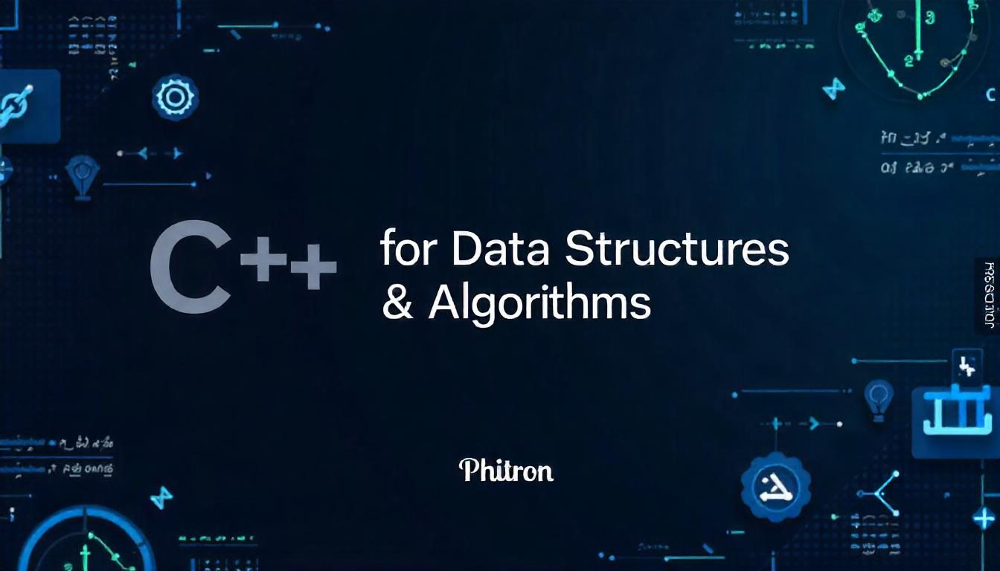
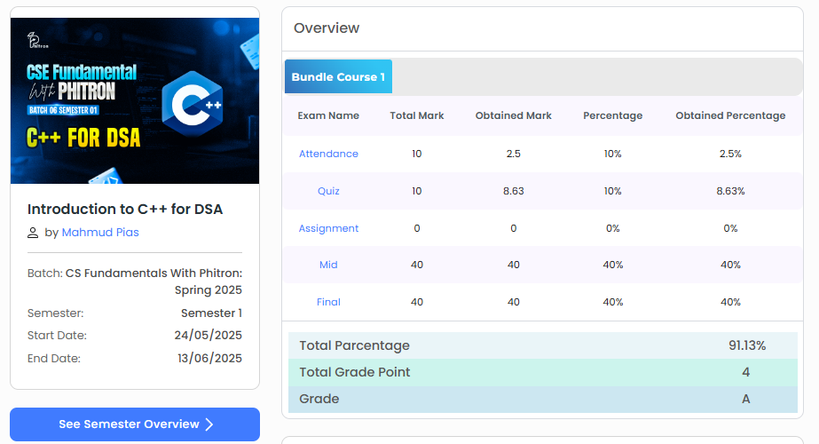

# C++ for Data Structures & Algorithms (Phitron)

 <!-- Replace with your own banner if you wish -->

## 📜 Certificate


_Add your certificate image to an `assets` folder and update the path above._

---

## Table of Contents

- [About the Project](#about-the-project)
- [Course Structure](#course-structure)
- [Skills & Topics Covered](#skills--topics-covered)
- [Project Organization](#project-organization)
- [How to Use](#how-to-use)
- [Certificate](#certificate)
- [Contact](#contact)

---

## About the Project

This repository documents my journey through the **CSE Fundamentals With Phitron: C++ for DSA** course (Spring 2025). The course, led by Mahmud Pias, is designed to build a strong foundation in C++ programming and its application in Data Structures and Algorithms (DSA).

**Motivation:**  
To master C++ for efficient problem-solving and to prepare for technical interviews and real-world software engineering challenges.

**What I Learned:**

- Core C++ syntax and best practices
- Dynamic memory management
- Object-oriented programming
- String manipulation
- Algorithmic problem-solving

---

## Course Structure

| Module                      | Topics                                                   |
| --------------------------- | -------------------------------------------------------- |
| Basic C++                   | Input/Output, Conditionals, Loops, Precision, Strings    |
| Dynamic Memory Allocation   | Dynamic arrays, pointers, memory management              |
| Class and Object            | OOP concepts, constructors, sorting, object manipulation |
| Mid Exam                    | Problem-solving and algorithmic thinking                 |
| String                      | String operations, competitive programming problems      |
| More About Class and String | Advanced OOP, string constructors, sorting               |
| Array of Object             | Arrays of objects, sorting, min/max operations           |
| Final Exam                  | Capstone problems, algorithmic challenges                |
| Practice Modules            | Additional practice for mastery                          |

---

## Skills & Topics Covered

- **C++ Fundamentals:** Variables, data types, operators, control flow
- **Dynamic Memory:** Pointers, dynamic arrays, memory allocation/deallocation
- **Object-Oriented Programming:** Classes, objects, constructors, member functions
- **Algorithms:** Sorting, searching, problem-solving
- **Strings:** Manipulation, parsing, competitive programming techniques
- **File I/O:** Reading from and writing to files

---

## Project Organization

```
Phitron - C++ for DSA/
│
├── Basic C++/
├── Module - 02 - Dynamic Memeory Allocation/
├── Module - 03 - Class and Object/
├── Module - 04 - Mid Exam/
├── Module - 05 - String/
├── Module - 06 - More About Class and String/
├── Module - 07 - Array of Object/
├── Module - 08 - Final Exam/
├── Practice Modules/
├── input.txt, output.txt
└── README.md
```

Each module contains `.cpp` source files and compiled `.exe` files for Windows.

---

## How to Use

1. **Clone the repository:**
   ```bash
   git clone https://github.com/tanvirTheDev/Phitron-c-plus-plus-for-DSA.git
   ```
2. **Navigate to a module:**
   ```bash
   cd "Phitron - C++ for DSA/Module - 03 - Class and Object"
   ```
3. **Compile a C++ file (if needed):**
   ```bash
   g++ example.cpp -o example.exe
   ```
4. **Run the executable:**
   ```bash
   ./example.exe
   ```

## Contact

**Author:** [Tanvir Ahamed]  
**LinkedIn:** [https://www.linkedin.com/in/tanvirthedev]  
**Email:** ahamedtanvir374@gmail.com

---

## Acknowledgments

- [Phitron](https://phitron.io/) for the course content and platform
- [Mahmud Pias](https://www.linkedin.com/in/mahmud-hossain-pias) for instruction and mentorship

---

> _This repository demonstrates my commitment to mastering C++ and DSA, and is a testament to my ability to learn, implement, and organize complex programming concepts in a professional manner._

---
